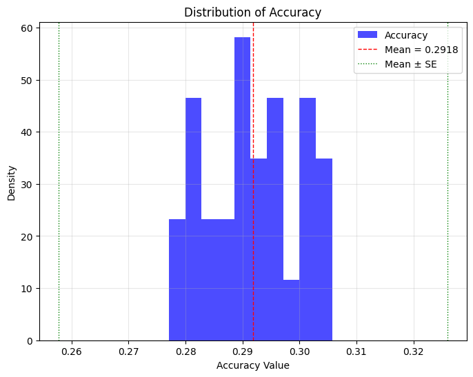

# Run benchmark

This benchmark is primarily intended to be used with reasoning models like `DeepSeek-R1` and its distilled models like `DeepSeek-R1-Distill-Qwen-1.5B`. Please use

```bash
pip install antlr4-python3-runtime
```

for `parse_latex` which we use for symbolic equality check.

## Benchmark sglang

1. Launch the Server

```bash
python3 -m sglang.launch_server --model-path deepseek-ai/DeepSeek-R1-Distill-Qwen-1.5B --port 30000
```

Note that depending on the GPU this benchmark will take quiet some time. To employ data parallelism please use:

```bash
python3 -m sglang_router.launch_server --model-path deepseek-ai/DeepSeek-R1-Distill-Qwen-1.5B --port 30000 --dp-size 4
```

2. Benchmarking

We use [suggested](https://github.com/deepseek-ai/DeepSeek-R1) parameters of `temperature=0.6`, `top_p=.95`, `max_new_tokens=32768`. The command line argument `num-tries` can be used to evaluate the model multiple times on the same question. We use the suggested `64` from the repo for AIME 2024. For LIMO, we use `8` as the number of tries due to the size of the dataset.

By default evaluate on LIMO dataset.

```bash
python3 bench_sglang.py --parallel 256 --num-tries 64 --port 30000
```

Evaluate on AIME 2024 dataset.

```bash
python3 bench_sglang.py --parallel 256 --port 30000 --data-path Maxwell-Jia/AIME_2024 --question-key Problem --answer-key Answer --num-tries 64
```

Evaluate on [AIME 2025 I dataset](https://huggingface.co/datasets/opencompass/AIME2025). For benchmark result see [here](https://matharena.ai/).

```bash
python3 bench_sglang.py --parallel 256 --port 30000 --data-path opencompass/AIME2025 --question-key question --answer-key answer --num-tries 64
```

## Further Statistic Analysis
This experiment aims to verify the reliability and stability of the model’s output in statistic method following the evaluation above. Check the `plot_benchmark.ipynb` for details.

### **Experiment 1: Fixed num_tries with Multiple Executions**
- In this experiment, we set a fixed number of attempts (num_tries) and conduct multiple runs to evaluate the model's performance consistency. For each run, we measure accuracy and compute the standard error, then derive the 95% confidence interval (CI) for accuracy. If all accuracy values lie within this CI, the model's performance is deemed stable; otherwise, it suggests potential instability.

### **Experiment 2: Varying num_tries with Single Executions**
- Here, we adjust num_tries across a range (e.g., 8, 16, 32, ..., 256) and perform a single run for each value to examine how the standard error (SE) changes. We plot SE against num_tries and expect the SE to decrease.

## Results

### Evaluation Results
| Dataset    | Num Tries | Accuracy | Reference |
|------------|-----------|----------|-----------|
| LIMO       | 8         | 47.7%    | ?         |
| AIME 2024  | 64        | 33.2%    | 28.9%     |
| AIME 2025 I| 64        | 29.9%    | 25.0%     |

### Statistic Analysis Results
- Experiment 1: In Experiment 1, the results show that all recorded accuracies lie within the CI based on the standard error. This indicates that, the **model's performance remains stable** across multiple independent runs.


- Experiment 2: In Experiment 2, we investigated the relationship between the number of attempts (num_tries) and the standard error (SE) by varying num_tries across multiple runs. The results reveal a clear trend: as num_tries increases, the SE consistently decreases.  Such a downward trend indicates that the more attempts are made on the same problem, the more stable the answer accuracy becomes.

